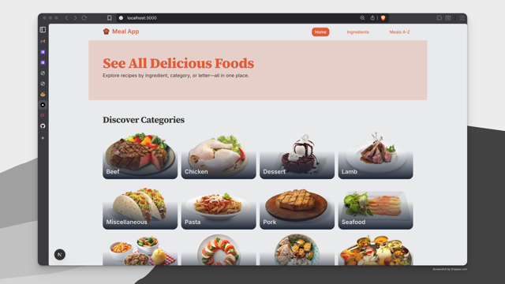
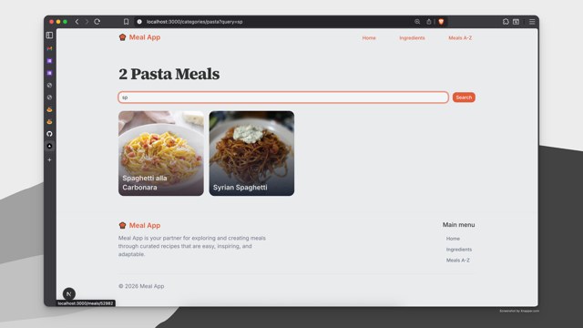
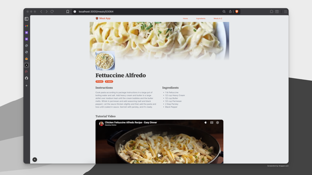
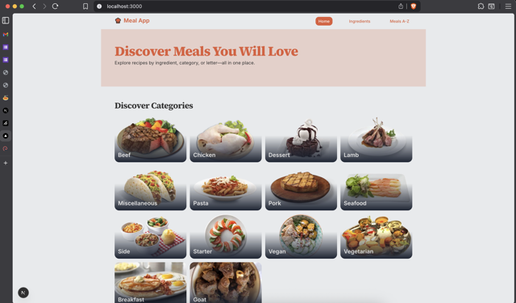
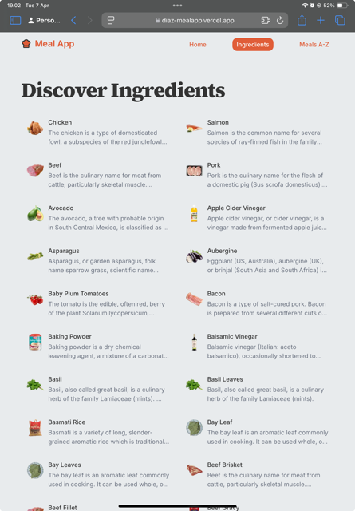
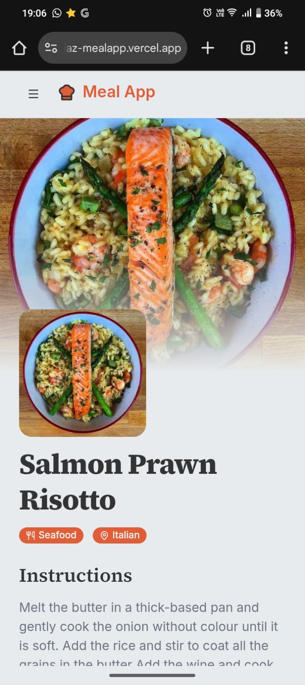

# MealApp Web

A Next.js App Router project that explores meals, categories, and ingredients using the public TheMealDB API. It includes category browsing, A–Z meal search, and a detailed meal page with ingredients and an optimized YouTube tutorial embed.

## Features

- Browse meal categories and related meals
- Browse meal ingredients and related meals
- Search meals by first letter (A–Z)
- View meal details with instructions, ingredients, and source link
- Lite YouTube embed to avoid loading heavy iframes until interaction

## Data Fetching & Rendering (Next.js)

- App Router async page components fetch data on the server before rendering
- Server actions in `src/lib/actions` call TheMealDB API via a shared Axios instance
- Pages are served by Next.js with server-rendered HTML and hydrated client UI

## Tech Stack

- Next.js 16 (App Router)
- React 19
- TypeScript
- Tailwind CSS v4

## Notable Libraries

- `axios` for API requests
- `react-lite-youtube-embed` for lightweight YouTube embeds
- `lucide-react` for icons
- `class-variance-authority`, `clsx`, `tailwind-merge`, `tw-animate-css` for UI and styling utilities
- `shadcn` and `radix-ui` for component patterns

## Main Pages

**Halaman Ingredients (Categories)**
List of meal ingredients (categories). Click a meal card to go to Halaman Meals Detail.



**Halaman Ingredients Detail (Category)**
Uses ingredient name as a route param. Search and filters meals by ingredient name. Click a meal card to go to Halaman Meals Detail.



**Halaman Meals Detail**
Uses meal id as a route param. Shows meal title, instructions, ingredients, and an embedded YouTube tutorial video.



## Responsive Views

**Desktop**



**iPad**



**Mobile**



## Getting Started

Prerequisites

- Node.js 18+ recommended
- npm (or your preferred package manager)

Clone

```bash
git clone https://github.com/Diaz-adrianz/cmlabs-frontend-parttime-test
cd web
```

Install

```bash
npm install
```

Environment
Create a `.env` file in the project root:

```bash
API_URL=https://www.themealdb.com/api/json/v1/1
```

Run (Development)

```bash
npm run dev
```

Visit `http://localhost:3000`.

Build and Start (Production)

```bash
npm run build
npm run start
```

## Scripts

- `npm run dev` Start dev server
- `npm run build` Build for production
- `npm run start` Run production server
- `npm run lint` Lint
- `npm run format` Check formatting
- `npm run format:fix` Auto-format

## Production

- Live Demo: [diaz-mealapp.vercel.app](https://diaz-mealapp.vercel.app/)

## API

- TheMealDB: `https://www.themealdb.com/api/json/v1/1`
